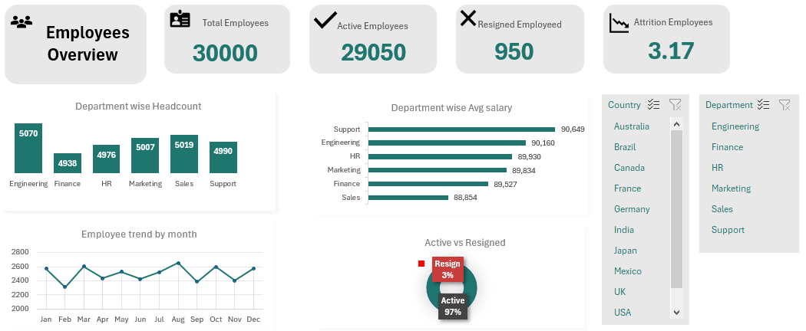

# Enterprise-Workforce-Dynamics-System
An interactive HR Operations &amp; Talent Analytics Dashboard built using Advanced Excel, Power Query, and Power Pivot to analyze a global enterprise workforce dataset of 30,000+ employees.

## About the Project

This is an Advanced Excel project created to analyze HR and employee data.

The project helps track employee information, workforce details, performance, salary and other HR-related data in one place.

## Tools Used

- Microsoft Excel
- Advanced Excel
- Pivot Tables
- Power Query
- Power Pivot
- DAX
- Charts and Dashboard

## What the Project Covers

- Employee overview
- Department-wise employee analysis
- Employee performance
- Salary analysis
- Workforce distribution
- Employee demographics
- Attrition analysis
- HR KPIs
- Interactive dashboard

## Key Features

- Interactive Excel dashboard
- Pivot Tables and Pivot Charts
- Slicers for filtering data
- Data cleaning using Power Query
- Calculations using Excel formulas
- KPI tracking
- Department and employee-level analysis

## Key Insights

The dashboard helps compare different departments, understand employee distribution, track performance and identify areas that need attention.

It also makes it easier to filter the data and look at specific employee or department details.

## Dashboard Preview

## Project File

The Excel file used for this project is available in this repository.

## Author

Ritu
